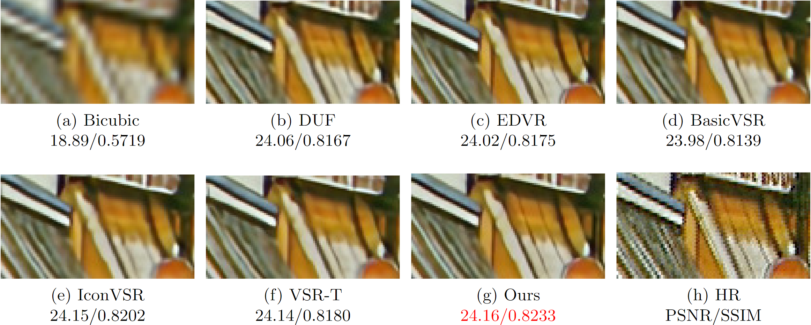
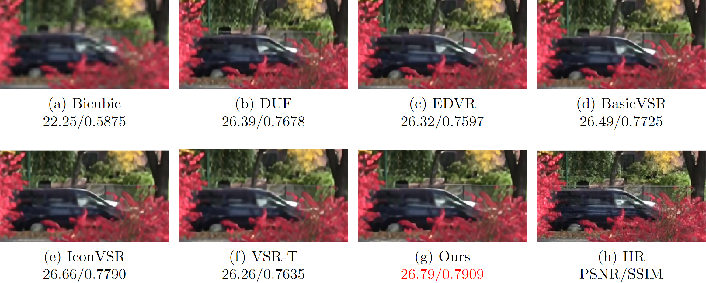
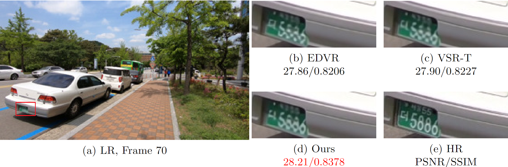
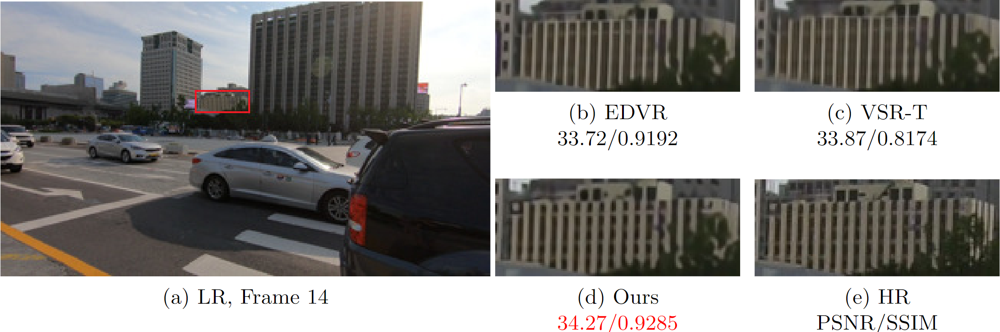
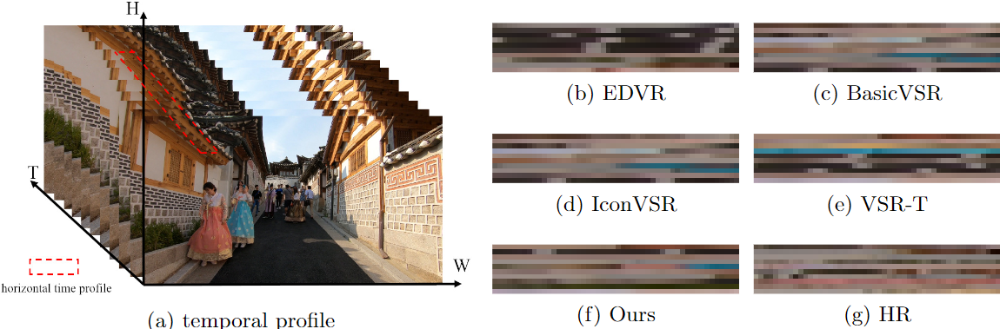

# Title

This repository is for the paper "Improving Bi-direction Recurrent Network for Video Super-Resolution with Deformable Motion Alignment Structure "


# Dataset Preparation

- Please refer to **[DatasetPreparation.md](docs/DatasetPreparation.md)** for more details.
- The descriptions of currently supported datasets (`torch.utils.data.Dataset` classes) are in [Datasets.md](docs/Datasets.md).


# Dependencies and Installation

- Python >= 3.7 (Recommend to use [Anaconda](https://www.anaconda.com/download/#linux) or [Miniconda](https://docs.conda.io/en/latest/miniconda.html))
- [PyTorch >= 1.7](https://pytorch.org/)
- NVIDIA GPU + [CUDA](https://developer.nvidia.com/cuda-downloads)

1. Clone repository

    ```bash
    git clone https://github.com/hengliusky/IBRN_VSR.git
    ```

2. Install dependent packages

    ```bash
    cd IBRN_VSR
    pip install -r requirements.txt
    ```

3. Compile basicsr environment

    ```bash
    python setup.py develop
    ```

# Training
```bash
# Train on REDS
sh train.sh reds

# train on vimeo-90k
sh train.sh vimeo90k

# train on RealVSR
sh train.sh real
```

# Testing
```bash
# test on reds
sh test.sh reds

# test on vimeo
sh test.sh vimeo90k

# test on vid4
sh test.sh vid4

# test on RealVSR
sh test.sh real
```

# Results

The visualization clustering comparisons on the Cora, Citeseer and Pubmed of our proposed approach with
R-DGAE, MAGCN and GMM-VGAE.

## Vid4 

### Calendar 

<p align="center">
  
</p>

### Foliage
<p align="center">
  
</p>


## REDS
### Clip 000 
<p align="center">
  
</p>

### Clip 015
<p align="center">
  
</p>

# Temporal Consistent
<p align="center">
  
</p>

